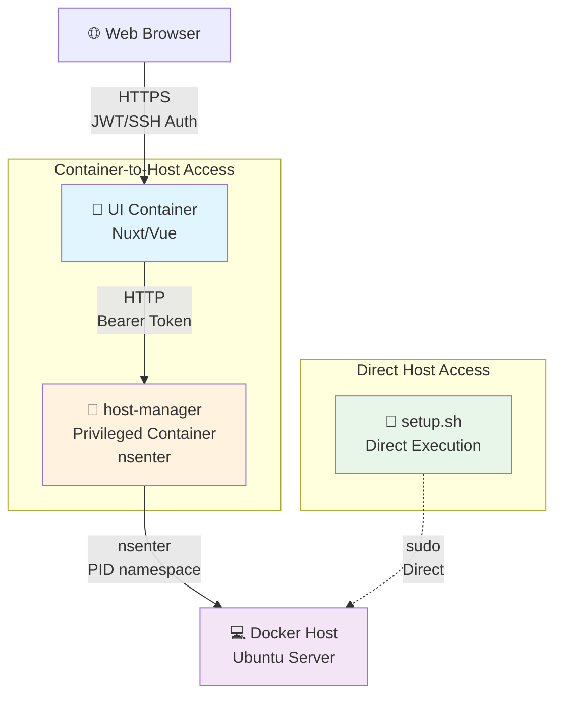

# System Update Feature

This feature allows authenticated users to trigger system updates directly from the Web UI, which executes the `setup.sh` script on the Docker host.

## Architecture



**Execution Contexts:**

1. **Setup Scripts** (`scripts/setup.sh`, `scripts/steps/*.ts`)
   - Run directly on the host with `sudo`
   - Full root privileges
   - No container isolation
   - Used during initial setup and system updates

2. **API Endpoints** (`server/api/**/*.ts`)
   - Run inside Nuxt container
   - Need host-manager to access host system
   - Limited to whitelisted operations
   - User must be authenticated

3. **host-manager Service**
   - Runs in privileged container
   - Uses `nsenter` to access host PID namespace
   - Validates all incoming requests
   - Command-specific endpoints (no generic exec)

## Security

1. **JWT or SSH Key Authentication**: Users authenticate via SSH key signatures, no password login
2. **Host-Manager Token**: Additional token for communication between UI and host-manager
3. **Network Isolation**: host-manager runs in an isolated network
4. **Privileged Execution**: Commands execute with proper host access via nsenter

## Installation

The setup script automatically configures everything including host-manager and tokens:

```bash
curl -o- https://raw.githubusercontent.com/jschirrmacher/swarm-config/main/scripts/setup.sh | sudo bash -s your-domain.com
```

The script automatically:

- Creates Docker Secret (Swarm) or .env file (Compose) for host-manager token
- Builds both Docker images (UI + host-manager)
- Deploys the complete stack

### Manual Installation

If you want to manage the token manually:

### 1. Generate and store token as Docker Secret

**For Production (recommended - Docker Swarm):**

```bash
openssl rand -hex 32 | docker secret create host_manager_token -
docker secret ls
```

**For Development (with .env file):**

```bash
echo "HOST_MANAGER_TOKEN=$(openssl rand -hex 32)" >> .env
```

### 2. Build host-manager image

```bash
cd host-manager
docker build -t host-manager:latest .
```

### 3. Deploy services

**Mit Docker Stack (Production - verwendet Secrets):**

```bash
docker stack deploy -c compose.yaml swarm-config
```

**Mit Docker Compose (Development - verwendet .env oder Environment):**

```bash
docker compose up -d
```

> **Wichtig:** Bei Docker Stack werden automatisch die Docker Secrets verwendet. Bei Docker Compose wird die `.env` Datei oder die Umgebungsvariable `HOST_MANAGER_TOKEN` verwendet.

## Usage

### Via Web UI

1. Log in to the Web UI (SSH key authentication)
2. Click "System Update" button in header
3. Confirm
4. Wait for execution (may take several minutes)
5. Follow live logs

**Note:** After a successful update, services restart, causing a brief connection interruption. Reload the page afterward.

### Via API

```bash
curl -X GET https://your-domain.com/api/system/update?token=$JWT_TOKEN
```

## Monitoring

### Logs des host-manager anzeigen

```bash
docker service logs swarm-config_host-manager
```

### Logs des UI-Containers

````bash
docker service logs swarm-config_ui
**Bei Docker Stack:**
```bash
# Secret überprüfen
docker secret ls | grep host_manager_token

# Wenn nicht vorhanden, erstellen
openssl rand -hex 32 | docker secret create host_manager_token -

# Stack neu deployen
docker stack deploy -c compose.yaml swarm-config
````

**Bei Docker Compose:**

```bash
# .env Datei überprüfen
cat .env | grep HOST_MANAGER_TOKEN

# Oder Umgebungsvariable setzen
export HOST_MANAGER_TOKEN=$(openssl rand -hex 32)
```

### "Authentication with host-manager failed"

Die Token stimmen nicht überein.

**Bei Docker Stack:**

```bash
# Secret neu erstellen
docker secret rm host_manager_token
openssl rand -hex 32 | docker secret create host_manager_token -
docker stack deploy -c compose.yaml swarm-config
```

**Bei Docker Compose:**
Stelle sicher, dass beide Services die gleiche `.env` Datei verwenden oder die gleiche Umgebungsvariable gesetzt ist

Der Token ist nicht gesetzt. Stelle sicher, dass die Umgebungsvariable bei beiden Services gesetzt ist.

### "Authentication with host-manager failed"

Die Token stimmen nicht überein. Überprüfe, dass beide Services den gleichen Token verwenden.

### "Kong container not found" oder ähnliche Fehler

Das Setup-Script schlägt fehl. Prüfe die Logs des privilegierten Containers:

```bash
docker service logs swarm-config_host-manager --tail 100
```

### Timeout-Fehler

Das Setup-Script braucht länger als 5 Minuten. Passe den Timeout in [server/api/system/update.post.ts](../server/api/system/update.post.ts) an:

```typescript
timeout: 600000, // 10 Minuten
```

## Entwicklung

### Lokale Entwicklung des host-manager

```bash
cd host-manager
npm install
export HOST_MANAGER_TOKEN="dev-token"
npm run dev
```

### Test-Request

```bash
curl -X POST http://localhost:3001/update \
  -H "Authorization: Bearer dev-token"
```

## Sicherheitsüberlegungen

### Was NICHT getan werden sollte:

- ❌ `host-manager` im `kong-net` laufen lassen (andere Container könnten darauf zugreifen)
- ❌ Token im Code hart codieren
- ❌ Setup-Script direkt aus dem Container heraus ausführen (keine sudo-Rechte)
- ❌ Docker Socket ohne Isolation mounten

### Best Practices:

- ✅ Separates `admin-net` Netzwerk verwenden
- ✅ Starke, zufällige Token verwenden
- ✅ Token als Umgebungsvariablen oder Secrets verwalten
- ✅ Logs aller Update-Versuche aufbewahren
- ✅ Privilegierte Container-Ausführung mit chroot

## Erweiterungen

### Rate Limiting hinzufügen

Implementiere Rate Limiting im `host-manager`, um Missbrauch zu verhindern:

```javascript
import rateLimit from "express-rate-limit"

const updateLimiter = rateLimit({
  windowMs: 15 * 60 * 1000, // 15 Minuten
  max: 3, // Max 3 Updates pro 15 Minuten
})

app.post("/update", authenticate, updateLimiter, async (req, res) => {
  // ...
})
```

### Webhook-Benachrichtigungen

Sende Benachrichtigungen bei erfolgreichen oder fehlgeschlagenen Updates:

```javascript
await fetch("https://hooks.slack.com/...", {
  method: "POST",
  body: JSON.stringify({
    text: `System update completed: ${response.success ? "✅" : "❌"}`,
  }),
})
```

### Rollback-Funktion

Implementiere eine Rollback-Funktion, die die letzte bekannte gute Konfiguration wiederherstellt.
