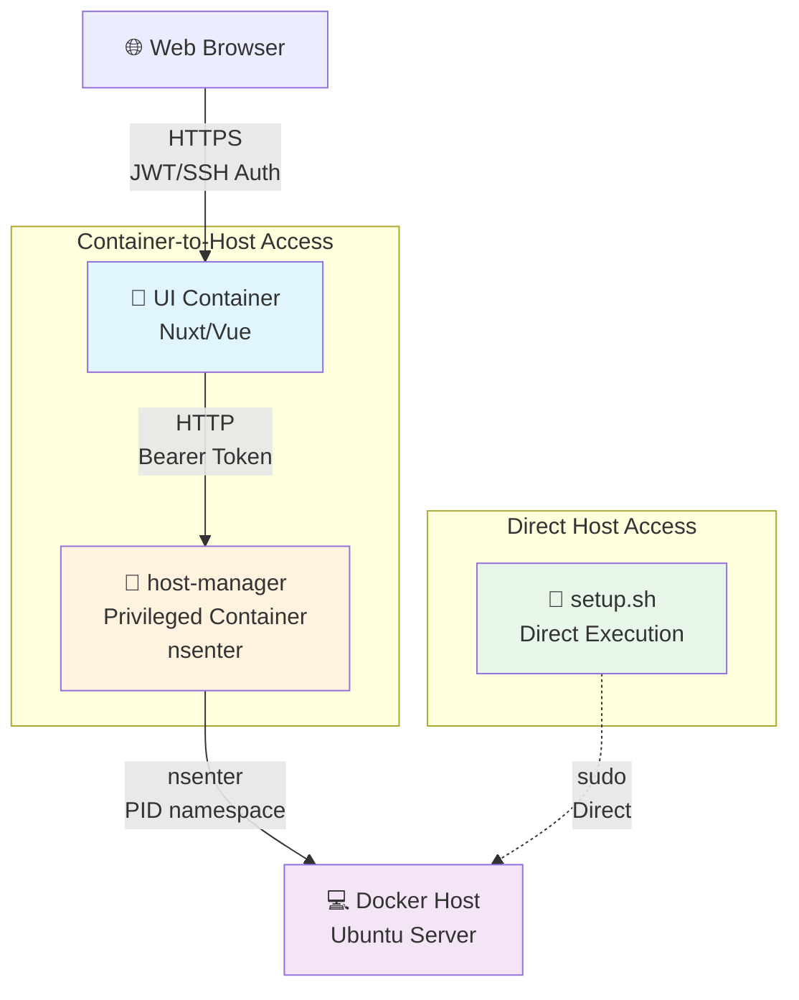

# System Setup Feature

This feature provides a web-based interface for managing system setup steps through individual, idempotent commands.

**Access:** `https://config.your-domain.com/setup`

## Overview

The setup system allows you to:

- Execute 13 individual setup steps (01-13)
- View real-time logs for each step
- Configure manual steps with inline inputs (SMTP, GlusterFS, Apps)
- Run all automatic steps with one button
- See completion status and last run time for each step

## Architecture


```mermaid
graph TB
    Browser[🌐 Web Browser]
    UI[🐳 UI Container<br/>Nuxt/Vue]
    HostMgr[🔧 host-manager<br/>Privileged Container<br/>nsenter]
    Host[💻 Docker Host<br/>Ubuntu Server]
    Setup[📜 setup.sh<br/>Direct Execution]

    Browser -->|HTTPS<br/>JWT/SSH Auth| UI
    UI -->|HTTP<br/>Bearer Token| HostMgr
    HostMgr -->|nsenter<br/>PID namespace| Host
    Setup -.->|sudo<br/>Direct| Host

    style UI fill:#e1f5ff
    style HostMgr fill:#fff3e0
    style Host fill:#f3e5f5
    style Setup fill:#e8f5e9

    subgraph "Container-to-Host Access"
        UI
        HostMgr
    end

    subgraph "Direct Host Access"
        Setup
    end
```

**Execution Contexts:**

1. **Setup Scripts** (`scripts/setup.sh`)
   - Run directly on the host with `sudo`
   - Full root privileges
   - No container isolation
   - Used during initial setup
   - Calls host-manager API for step execution

2. **host-manager Service** (`host-manager/`)
   - Runs in privileged container
   - Uses `nsenter` to access host PID namespace
   - Validates all incoming requests
   - Executes setup commands (`host-manager/commands/setup/`)
   - Command-specific endpoints (no generic exec)

3. **Web UI** (`pages/setup/`)
   - Authenticated interface at `/setup`
   - Proxies requests to host-manager
   - Shows live logs and status
   - Provides inline configuration for manual steps

## Setup Steps

The system includes 13 setup steps:

## Security

1. **JWT or SSH Key Authentication**: Users authenticate via SSH key signatures, no password login
2. **Host-Manager Token**: Additional token for communication between UI and host-manager
3. **Network Isolation**: host-manager runs in an isolated network
4. **Privileged Execution**: Commands execute with proper host access via nsenter

## Installation

The setup script automatically configures everything including host-manager and tokens:

```bash
curl -o- https://raw.githubusercontent.com/jschirrmacher/swarm-config/main/scripts/setup.sh | sudo bash -s your-domain.com
```

The script automatically:

- Creates Docker Secret (Swarm) or .env file (Compose) for host-manager token
- Builds both Docker images (UI + host-manager)
- Deploys the complete stack

### Manual Installation

If you want to manage the token manually:

### 1. Generate and store token as Docker Secret

**For Production (recommended - Docker Swarm):**

### Automatic Steps (run with "Run All Steps"):

1. **Configure Security Updates** - Setup unattended-upgrades
2. **Configure Domain** - Set DOMAIN in .env
3. **Install Docker** - Install docker.io and initialize Swarm
4. **Install Firewall** - Setup UFW (ports 22, 80, 443, 2377, 4789, 7946)
5. **Create Users** - Create team users from SSH keys
6. **Configure SSH** - Harden SSH (disable root, password auth)
7. **Create Network** - Create kong-net overlay network
8. **Setup Host-Manager Token** - Generate and configure token
9. **Install msmtp** - Install email sending tool
10. **Deploy Kong** - Deploy Kong Gateway stack
11. **Deploy Web UI** - Build and deploy swarm-config UI

### Manual Steps (require configuration):

- **09.5 Configure SMTP** - Set SMTP credentials for email
- **12 Install GlusterFS** - Optional distributed storage
- **13 Prepare Apps** - Setup /var/apps directory structure

## Security

1. **JWT or SSH Key Authentication**: Users authenticate via SSH key signatures, no password login
2. **Host-Manager Token**: Additional token for communication between UI and host-manager
3. **Network Isolation**: host-manager runs in an isolated network
4. **Privileged Execution**: Commands execute with proper host access via nsenter

## Installation

The setup script automatically configures everything including host-manager and tokens:

```bash
curl -o- https://raw.githubusercontent.com/jschirrmacher/swarm-config/main/scripts/setup.sh | sudo bash -s your-domain.com
```

The script automatically:

- Creates Docker Secret for host-manager token
- Builds both Docker images (UI + host-manager)
- Starts host-manager container
- Executes all automatic setup steps via API
- Deploys the complete stack

### Manual Setup

Stelle sicher, dass beide Services die gleiche `.env` Datei verwenden oder die gleiche Umgebungsvariable gesetzt ist

Der Token ist nicht gesetzt. Stelle sicher, dass die Umgebungsvariable bei beiden Services gesetzt ist.

### "Authentication with host-manager failed"

Die Token stimmen nicht überein. Überprüfe, dass beide Services den gleichen Token verwenden.

### "Kong container not found" oder ähnliche Fehler

Das Setup-Script schlägt fehl. Prüfe die Logs des privilegierten Containers:

```bash
docker service logs swarm-config_host-manager --tail 100
```

### Timeout-Fehler

Das Setup-Script braucht länger als 5 Minuten. Passe den Timeout in [server/api/system/update.post.ts](../server/api/system/update.post.ts) an:

```typescript
timeout: 600000, // 10 Minuten
```

## Entwicklung

### Lokale Entwicklung des host-manager

```bash
cd host-manager
npm install
export HOST_MANAGER_TOKEN="dev-token"
npm run dev
```

### Test-Request

```bash
curl -X POST http://localhost:3001/update \
  -H "Authorization: Bearer dev-token"
```

## Sicherheitsüberlegungen

### Was NICHT getan werden sollte:

- ❌ `host-manager` im `kong-net` laufen lassen (andere Container könnten darauf zugreifen)
- ❌ Token im Code hart codieren
- ❌ Setup-Script direkt aus dem Container heraus ausführen (keine sudo-Rechte)
- ❌ Docker Socket ohne Isolation mounten

### Best Practices:

- ✅ Separates `admin-net` Netzwerk verwenden
- ✅ Starke, zufällige Token verwenden
- ✅ Token als Umgebungsvariablen oder Secrets verwalten
- ✅ Logs aller Update-Versuche aufbewahren
- ✅ Privilegierte Container-Ausführung mit chroot

If you prefer to set up manually or customize the installation:

```bash
# 1. Clone repository
git clone https://github.com/jschirrmacher/swarm-config.git
cd swarm-config

# 2. Create host-manager token
openssl rand -hex 32 | docker secret create host_manager_token -

# 3. Build host-manager image
docker build -t host-manager:latest ./host-manager

# 4. Start host-manager container
docker run -d \
  --name host-manager-setup \
  --network host \
  --cap-add SYS_ADMIN \
  --security-opt apparmor=unconfined \
  --pid host \
  -v /var/run/docker.sock:/var/run/docker.sock \
  --secret host_manager_token \
  host-manager:latest

# 5. Execute setup via API
TOKEN=$(docker secret inspect host_manager_token --format '{{.Spec.Data}}' | base64 -d)
curl -N -H "Authorization: Bearer $TOKEN" \
     -H "Content-Type: application/json" \
     -d '{}' \
     http://localhost:3001/setup/run
```

## Usage

### Via Web UI

1. Navigate to `https://config.your-domain.com/setup`
2. Log in with SSH key authentication
3. View all 13 setup steps with their status
4. Click "Run All Steps" to execute all automatic steps
5. Expand individual steps to see logs
6. Configure manual steps inline (SMTP, GlusterFS)
7. Click "Run" or "Run with these settings" for individual steps

### Via Command Line

Run all setup steps directly:

```bash
cd /var/apps/swarm-config
sudo bash scripts/setup.sh your-domain.com
```

Run individual step via API:

```bash
curl -X POST https://config.your-domain.com/api/setup/step/09.5-configure-smtp \
  -H "Authorization: Bearer $TOKEN" \
  -H "Content-Type: application/json" \
  -d '{"inputs": {"smtpHost": "smtp.gmail.com", "smtpPort": "587"}}'
```

## Logs and State

### Log Files

Setup logs are persisted to the filesystem:

- **Location:** `/var/lib/host-manager/logs/`
- **Format:** `<step-id>.log` (e.g., `01-configure-security-updates.log`)
- **Behavior:** Overwritten on each new execution (not appended)

View logs directly:

```bash
cat /var/lib/host-manager/logs/11-deploy-webui.log
```

### State Management

Setup state is stored in JSON:

- **Location:** `/var/lib/host-manager/setup-state.json`
- **Content:** Step status, last run time, results, errors

View state:

```bash
cat /var/lib/host-manager/setup-state.json | jq '.'
```

## Monitoring

### Host-Manager Container Logs

```bash
docker logs host-manager-setup
```

### Check Setup Status

```bash
curl -H "Authorization: Bearer $TOKEN" \
  http://localhost:3001/setup/steps | jq '.'
```

## Troubleshooting

### "This node is not a swarm manager"

Docker Swarm was not initialized correctly:

```bash
# Re-initialize Swarm with explicit IP
sudo docker swarm init --advertise-addr $(hostname -I | awk '{print $1}')
```

### "Authentication with host-manager failed"

Token mismatch between UI and host-manager:

```bash
# Recreate secret
docker secret rm host_manager_token
openssl rand -hex 32 | docker secret create host_manager_token -

# Restart services
docker stack deploy -c compose.yaml swarm-config
```

### Step stuck or timeout

Check host-manager logs:

```bash
docker logs host-manager-setup -f
```

Restart host-manager:

```bash
docker stop host-manager-setup
docker rm host-manager-setup
# Then re-run setup.sh
```

## Extensions

### Rate Limiting

Add rate limiting to prevent abuse:

```typescript
import rateLimit from "express-rate-limit"

const setupLimiter = rateLimit({
  windowMs: 15 * 60 * 1000, // 15 minutes
  max: 5, // Max 5 setup runs per 15 minutes
})

app.post("/setup/run", authenticate, setupLimiter, async (req, res) => {
  // ...
})
```

### Webhook Notifications

Send notifications on setup completion:

```typescript
await fetch("https://hooks.slack.com/...", {
  method: "POST",
  body: JSON.stringify({
    text: `Setup completed: ${succeeded} succeeded, ${failed} failed`,
  }),
})
```
